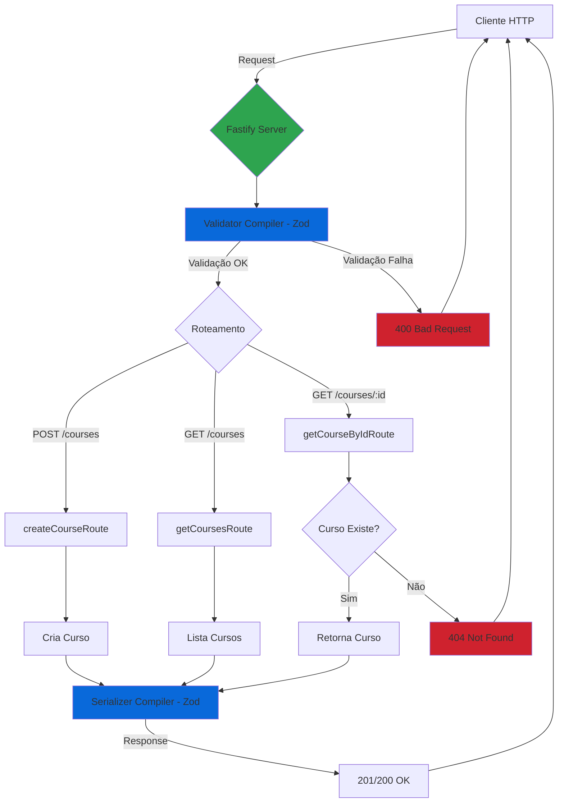

<!-- @import "[TOC]" {cmd="toc" depthFrom=1 depthTo=6 orderedList=false} -->
# Desafio Node.js (Fastify + Zod)

API em Node.js usando Fastify com validação via Zod, documentação OpenAPI e UI via Scalar.

## Setup

- Pré-requisitos: Node.js 18+, npm ou pnpm
- Instalação:
  ```bash
  npm install
  # ou
  pnpm install
  ```

## Migrações

Este projeto não usa banco de dados por padrão.

- Se adicionar um ORM (ex.: Prisma), documente aqui:
  - Configurar `.env`
  - Criar schema
  - Executar migrações
  - Atualizar rotas para persistência

## Execução

- Desenvolvimento:
  ```bash
  NODE_ENV=development node server.ts
  # ou com tsx/ts-node (se configurado):
  NODE_ENV=development tsx server.ts
  ```
- Servidor: `http://localhost:3333`

## Documentação

- OpenAPI habilitada quando `NODE_ENV=development`.
- Scalar (UI): `http://localhost:3333/docs`

## Fluxo da Aplicação



## Endpoints

### Cursos

#### POST `/courses`

Cria um novo curso.

**Request Body:**

```json
{
  "title": "Node.js Básico",
  "description": "Introdução ao Node.js"
}
```

**Response:** `201 Created`

---

#### GET `/courses`

Lista todos os cursos.

**Response:** `200 OK`

```json
[
  {
    "id": "1",
    "title": "Node.js Básico",
    "description": "Introdução ao Node.js"
  }
]
```

---

#### GET `/courses/:id`

Obtém um curso por ID.

**Params:**

- `id` - ID do curso

**Response:** `200 OK`

```json
{
  "id": "1",
  "title": "Node.js Básico",
  "description": "Introdução ao Node.js"
}
```

**Erros:**

- `404 Not Found` - Curso não encontrado

---

Validação: `validatorCompiler` (entrada) e `serializerCompiler` (saída) com Zod.

## Dicas

- Defina `NODE_ENV=development` para ver Swagger/Scalar.
- Ajuste a porta em `server.listen({ port: 3333 })` conforme necessidade.
- Use logs do Pino (com pino-pretty) para desenvolvimento.
- Mantenha schemas Zod sincronizados com a OpenAPI para evitar inconsistências.

## Estrutura (resumo)

- `server.ts` — Fastify, Zod, Swagger, Scalar e registro de rotas.
- `src/routes/create-course.ts` — criação de curso.
- `src/routes/get-courses.ts` — listagem de cursos.
- `src/routes/get-course-by-id.ts` — obter curso por ID.
